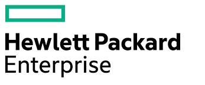
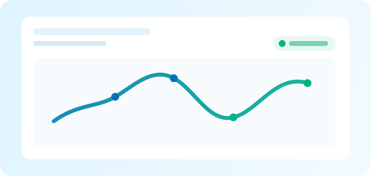
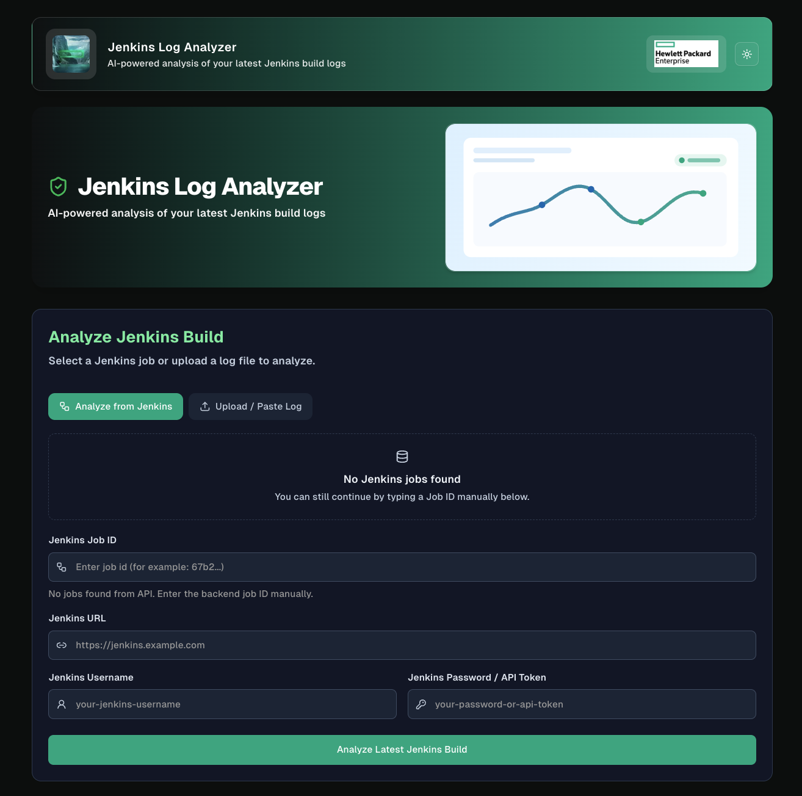
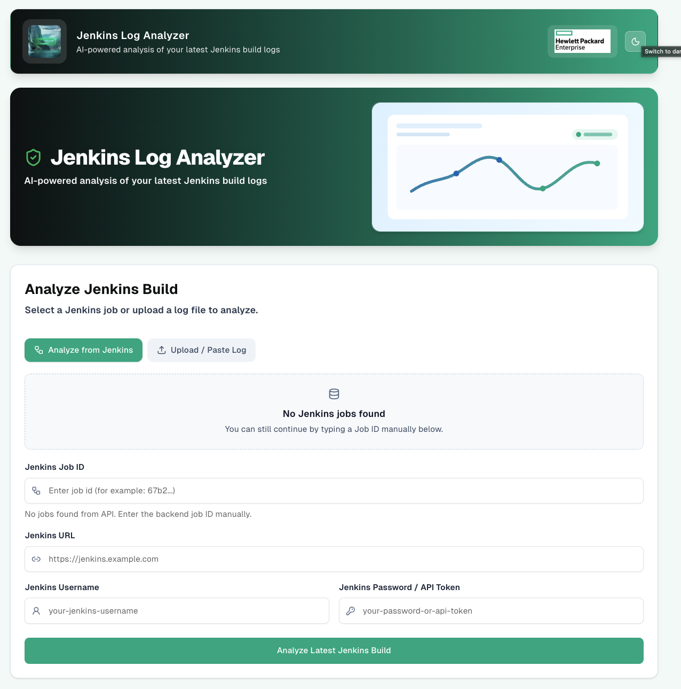
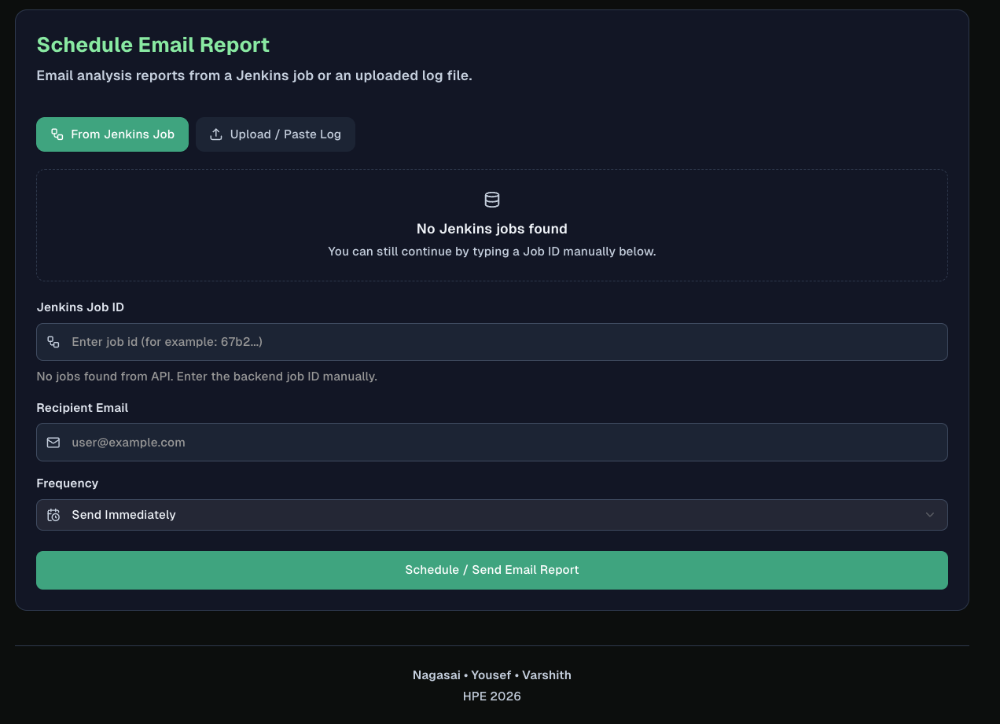
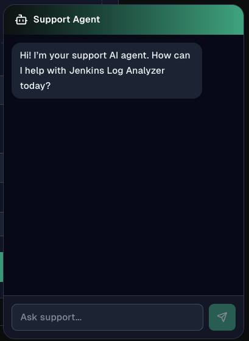
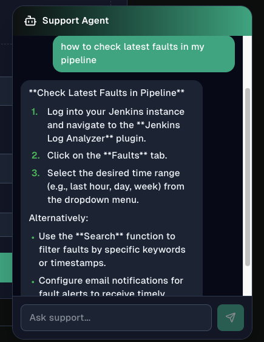
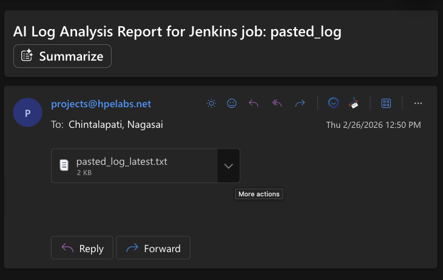

<p align="center">
  
</p>

<h1 align="center">Jenkins Log Analyzer</h1>

<p align="center">
  <b>AI-powered analysis of your Jenkins build logs</b><br/>
  Automatically fetch, analyze, and email actionable insights from CI/CD pipelines.
</p>

<p align="center">
  
  
  
  
  
</p>

---

## Screenshots

<p align="center">
  
</p>

<p align="center">
  
</p>

<p align="center">
  
</p>

<p align="center">
  
</p>

<p align="center">
  
</p>

<p align="center">
  
</p>

<p align="center">
  
</p>

---

## Features

| Feature | Description |
|---------|-------------|
|  **AI Log Analysis** | Fetch logs from any Jenkins job and get an AI-powered summary with root-cause analysis |
|  **Drag & Drop Upload** | Upload or paste raw log files directly — no Jenkins credentials needed |
|  **Email Reports** | One-click email delivery of analysis reports via SMTP |
|  **Scheduled Analysis** | Register Jenkins jobs for automatic periodic analysis |
|  **Dark Mode** | Full dark/light theme toggle with persistent preference |
|  **Support Chat** | Built-in AI chat widget for troubleshooting help |
|  **Chunked Processing** | Handles large log files by splitting them into manageable chunks |
|  **Confidence Metrics** | Shows a confidence % for each analysis with click-to-open detailed breakdown |
|  **Backtrack Similarity** | Compares the current result with the last 1-3 session results and shows similarity % |

---

## Architecture

```
┌─────────────────┐        ┌─────────────────┐        ┌──────────────┐
│   Next.js 16    │  REST  │   Flask API     │  HTTP  │   Ollama     │
│   Frontend      │◄──────►│   (port 5005)   │◄──────►│  LLaMA 3.1  │
│   (port 3000)   │        │                 │        │  (port 11434)│
└─────────────────┘        └────────┬────────┘        └──────────────┘
                                    │
                           ┌────────▼────────┐
                           │    MongoDB      │
                           │  (port 27017)   │
                           └─────────────────┘
```

---

## 📁 Project Structure

```
Jenkings-Log-Analyser/
├── flask/                          # Backend API server
│   ├── app.py                      # Main Flask application & all API routes
│   ├── send_email.py               # SMTP email delivery module
│   ├── requirements.txt            # Python dependencies
│   ├── Dockerfile                  # Container build file
│   ├── logs/                       # Runtime log cache (git-ignored)
│   └── reports/                    # Saved analysis reports
│
├── chatbot-frontend/               # Next.js 16 frontend
│   ├── src/
│   │   ├── app/                    # Next.js app router (layout, page, styles)
│   │   ├── components/
│   │   │   ├── forms/              # Analyze & Schedule Email forms
│   │   │   ├── layout/             # TopNav, Footer, ThemeToggle, PageHeader
│   │   │   ├── common/             # SectionCard, AnalysisResultCard, EmptyState
│   │   │   ├── support/            # AI Support Chat widget
│   │   │   └── ui/                 # shadcn/ui primitives
│   │   ├── hooks/                  # Custom React hooks
│   │   └── lib/                    # API client & utilities
│   └── public/images/              # Static assets (logos, hero images)
│
├── common/                         # Shared Python modules
│   ├── __init__.py
│   └── llm_client.py               # LLM API client
│
├── .env.example                    # Environment variable template
├── .gitignore                      # Git ignore rules
└── README.md                       # ← You are here
```

---

## Getting Started

### Prerequisites

| Tool | Version | Purpose |
|------|---------|---------|
| **Python** | 3.10+ | Backend API |
| **Node.js** | 18+ | Frontend build |
| **MongoDB** | 7.x / 8.x | Job storage |
| **Ollama** | Latest | Local LLM inference |

### 1. Clone the Repository

```bash
git clone https://github.com/yousef-konswah-hpe/Jenkings-Log-Analyser.git
cd Jenkings-Log-Analyser
```

### 2. Set Up the LLM (Ollama)

```bash
# Install Ollama — https://ollama.com/download
brew install ollama          # macOS

# Start the Ollama server
ollama serve

# Pull the LLaMA 3.1 model (in a new terminal)
ollama pull llama3.1:8b
```

### 3. Set Up MongoDB

```bash
# macOS (Homebrew)
brew tap mongodb/brew
brew install mongodb-community
brew services start mongodb-community

# Verify connection
mongosh --eval "db.runCommand({ ping: 1 })"
```

### 4. Configure Environment Variables

```bash
# Copy the template
cp .env.example .env

# Edit .env with your settings
```

**`.env` reference (must be placed at `flask/.env`):**

```env
# ── LLM (Ollama) ──
LLM_PROVIDER=ollama
LLM_API_URL=http://localhost:11434/api/chat
LLM_MODEL_NAME=llama3.1:8b
LLM_AUTH_TOKEN=                     # not needed for local Ollama
LLM_TIMEOUT_SECONDS=600
LLM_MAX_RETRIES=3
LLM_VERIFY_TLS=true

# ── MongoDB ──
# Leave USER/PASSWORD empty for local dev (no auth needed).
# Only set these if your MongoDB instance has authentication enabled.
MONGO_USER=
MONGO_PASSWORD=
MONGO_HOST=localhost
MONGO_PORT=27017
MONGO_DB=jenkins
MONGO_AUTH_DB=admin

# ── SMTP (Outlook / HPE) ──
SMTP_SERVER=smtp.office365.com
SMTP_PORT=587
SMTP_FROM_EMAIL=your-name@hpe.com
SMTP_USERNAME=your-name@hpe.com
SMTP_PASSWORD=your-password-or-app-password
SMTP_USE_TLS=true
SMTP_USE_SSL=false
```

> **SMTP note:** If your HPE account uses **SSO / MFA**, you may need to generate an App Password in your [Microsoft account security settings](https://mysignins.microsoft.com/security-info) or ask your IT admin to allow SMTP AUTH for your mailbox.
>
> **Test it:** Hit the **Test Email** button in the UI or call `POST /api/email-test` with `{ "to": "your-email@hpe.com" }`.

### 5. Install & Start the Backend

```bash
# Create a Python virtual environment
python3 -m venv .venv
source .venv/bin/activate

# Install dependencies
pip install -r flask/requirements.txt

# Start the Flask server
cd flask
python app.py
# → Running on http://localhost:5005
```

### 6. Install & Start the Frontend

```bash
# In a new terminal
cd chatbot-frontend

# Install Node dependencies
npm install

# Start the dev server
npm run dev
# → Running on http://localhost:3000
```

### 7. Open the Application

Navigate to **http://localhost:3000** in your browser.

---

## 📡 API Endpoints

| Method | Endpoint | Description |
|--------|----------|-------------|
| `GET` | `/api/health` | Health check |
| `GET` | `/api/jobs` | List registered Jenkins jobs |
| `POST` | `/api/jobs` | Register a new Jenkins job |
| `DELETE` | `/api/jobs/<id>` | Delete a registered job |
| `POST` | `/api/analyze` | Analyze a registered Jenkins job's latest build |
| `POST` | `/api/analyze-log` | Analyze uploaded/pasted log text directly |
| `POST` | `/api/email-log-report` | Analyze uploaded log and email the report |
| `POST` | `/schedule-email/<id>` | Trigger or schedule email for a job |
| `POST` | `/api/chat/support` | AI support chat endpoint |
| `POST` | `/api/email-test` | SMTP connectivity test |

---

## Result Intelligence Metrics

The analysis result card includes two interactive metrics:

1. **Confidence %**
  - Click the badge to open a breakdown.
  - Includes quality dimensions (evidence coverage, specificity, structure, certainty), positive/risk signals, and **"Why this is not 100%"** when applicable.
  - This value is a transparent heuristic from backend analysis signals.

2. **Backtrack %**
  - Click the badge to open a comparison breakdown.
  - Compares the latest output with the previous 1-3 outputs in the same browser session.
  - Highlights exact 100% matches, top shared terms, and synonym-level matches so users can quickly spot repeated vs new findings.

### Developer Notes

- Confidence metric logic: `flask/app.py` (`build_confidence_metrics`)
- Backtrack session comparison logic: `chatbot-frontend/src/lib/result-history.ts`
- Metric UI rendering: `chatbot-frontend/src/components/common/analysis-result-card.tsx`

---

##  Docker (Optional)

```bash
cd flask
docker build -t jenkins-log-analyzer .
docker run -p 5005:5005 --env-file ../.env jenkins-log-analyzer
```

---

## 🛠️ Tech Stack

| Layer | Technology |
|-------|-----------|
| **Frontend** | Next.js 16, React 19, TypeScript, Tailwind CSS, shadcn/ui, React Hook Form, Zod |
| **Backend** | Flask, Python 3.10+, APScheduler, python-jenkins |
| **AI/LLM** | Ollama (LLaMA 3.1 8B), chunked log processing |
| **Database** | MongoDB 8.x |
| **Email** | SMTP (configurable via env vars) |
| **Icons** | Lucide React |

---

##  Authors

<table>
  <tr>
    <td align="center">
      <b>Nagasai Chintalapati</b><br/>
      <a href="mailto:nagasai.chintalapati@hpe.com">nagasai.chintalapati@hpe.com</a>
    </td>
    <td align="center">
      <b>Yousef Konswah</b><br/>
      <a href="mailto:yousef.konswah@hpe.com">yousef.konswah@hpe.com</a>
        </td>
    <td align="center">
      <b>Varshith</b><br/>
      <a href="mailto:varshith-r@hpe.com">varshith-r@hpe.com</a>
    </td>
  </tr>
</table>

---

## License

This project is proprietary to **Hewlett Packard Enterprise (HPE)**. All rights reserved.
